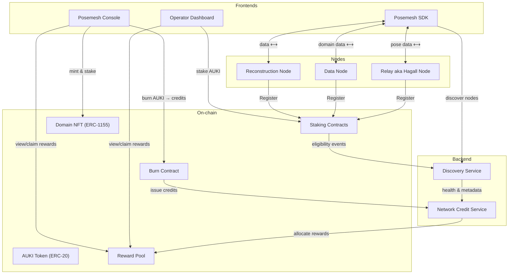
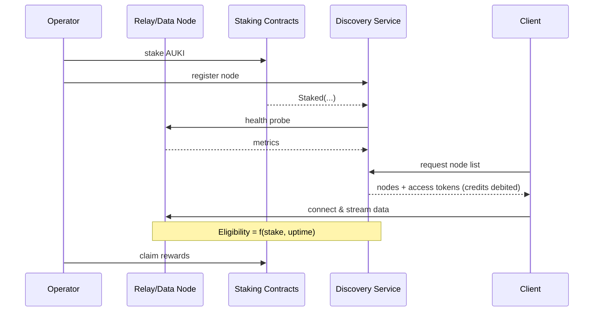

# Posemesh $AUKI MVP - Technical Architecture Overview

> How we built the posemesh first iteration

## Background

The posemesh began as a web‑2 solution to solve real businesses' problem. It proved the tech works, but it still relies on Aukilabs’ own infrastructure.

Now we’re turning it into an open, web‑3 protocol, to help it grow and start building in public.

## Motivation

This overview summarizes where the posemesh is today, what already runs on‑chain and what is still off‑chain, so that new contributors can quickly understand the starting point.

Use it to spot gaps, suggest solutions, and help us push more of the system into Web 3.

## Glossary

| Term                       | Definition                                                                                                                                                  |
|----------------------------|-------------------------------------------------------------------------------------------------------------------------------------------------------------|
| **Decentralized Protocol** | A set of open, permissionless smart contracts and services that can be run, audited, or extended by anyone without a central authority.                     |
| **Spatial Computing**      | Processing of 3‑D position, orientation, and environment data to anchor digital content in physical space.                                                  |
| **Domain**                 | A physical space represented on Posemesh, identified by an ID (and optionally a Domain NFT) and associated with spatial data (maps, meshes, anchors, etc.). |
| **Portal**                 | A physical or virtual spatial QR/AQR code used for positioning and building a shared coordinate systems within a Domain; m:n relationships to domains.      |
| **ERC‑20 Token**           | The fungible‑token standard on Ethereum‑compatible chains; balances are interchangeable and divisible.                                                      |
| **Staking**                | Locking tokens in a contract as a financial commitment and to become eligible.                                                                              |
| **Burning**                | Permanently removing tokens from circulation by sending them to an address with no private key.                                                             |
| **Credits**                | Accounting units (1 credit ≈ 1 USD) issued when developers burn AUKI; consumed when clients access/consume network resources.                               |
| **Participation Rewards**  | A finite amount of AUKI tokens in the Reward Pool used to reward early adopters helping bootstrapping the network; coming from the treasury foundation.     |
| **Performance Rewards**    | The *infinite* amount of AUKI token minted to the Reward Pool when AUKI tokens are burned; used to reward Operators according to monitored performances.    |
| **Domain Data**            | Files (maps, meshes, anchors, assets) that describe a physical domain; stored on Data Nodes.                                                               |
| **Pose Data**              | Low‑latency streams of poses, transforms, and entity updates exchanged via Relay Nodes.                                                                     |

---

## Overall Architecture

---

## Core Concepts

### Posemesh

A **decentralized protocol** for collaborative **spatial computing**.

### AUKI Token

An **ERC‑20 token** deployed on Base mainnet. Utility:

1. **Staking** by nodes and Domain owners.
2. **Burning** to obtain Posemesh Credits.
3. **Rewards** paid out from the Reward Pool when Credits used.

### Domain NFT

An **ERC‑1155** token representing ownership of a Domain. Holders can:

- Transfer or fractionalise (not implemented) ownership.
- **Stake** AUKI to qualify for Participation Rewards.
- Earn rewards based on average Daily Active Users (DAU) in the Domain.

---

## On‑chain Components

| Contract                  | Purpose                                                                                                   |
|---------------------------|-----------------------------------------------------------------------------------------------------------|
| **AukiToken** (ERC‑20)    | Core fungible token.                                                                                      |
| **Burn Contract**         | Burns AUKI in exchange for Credits; routes 50 % (increasing to 100%) of burned amount to the Reward Pool. |
| **Staking Contracts**     | Track stakes for eligibility of nodes and Domain owners.                                                  |
| **Reward Pool**           | Holds reward emissions; disburses when `claim()` is called by the owner.                                  |
| **Domain NFT** (ERC‑1155) | Non‑fungible (or semi‑fungible) tokens representing Domains.                                              |

All contracts follow the **UUPS proxy upgrade pattern**, are written in **Foundry** with **OpenZeppelin** libraries, and have passed a security audit.

---

## Backend Services (temporarily off‑chain)

> **Goal: migrate as much logic on‑chain as feasible in future releases.**
>

| Service                    | Responsibilities                                                                                                                                     |
|----------------------------|------------------------------------------------------------------------------------------------------------------------------------------------------|
| **Network Credit Service** | Mints Credits after on‑chain burns; debits Credits per access; calculates periodic reward allocations.                                               |
| **Discovery Service**      | Registers nodes and Domains; tracks health (uptime, latency, geolocation); exposes discovery API to SDK; listens to staking events for eligibility.  |
| **Auth**                   | (Web2 for MVP) Organisation/user/app auth and wallet binding.                                                                                        |
| **BEL**                    | Bridges on‑chain events to backend.                                                                                                                  |

---

## Node Types

| Node                   | Description                                                  | Reward Basis    |
|------------------------|--------------------------------------------------------------|-----------------|
| **Relay Node**         | Hosts real‑time sessions, routing Pose Data between clients. | Uptime × Stake  |
| **Data Node**          | Stores and serves Domain Data.                               | Uptime × Stake  |
| **Reconstruction Node** | Compute reconstruction of scene                              | Not implemented |

---

## Node Lifecycle & Discovery

---

## Front‑ends

### Posemesh SDK

- Connect to eligible Nodes via Discovery Service.
- Read/Write Domain Data.
- Publish/Subscribe Pose Data streams.
- Scan QR codes (Portals) and calibrate in a 3D coordinate system in a Domain.
- See https://conjurekit.dev/

### Posemesh Web Console (Developers)

- Manage apps, domains, portals, assets, and wallets.
- Burn AUKI → Credits.
- View usage, credit balance, and reward history.
- Mint & stake Domain NFTs.
- Stake for Data Nodes.
- Claim rewards.

### Operator Web Dashboard (Node Providers)

- Real‑time map of network nodes.
- Stake AUKI for Relay Nodes.
- Claim rewards.

## References

- [Domain Discovery Service API](https://dds.auki.network/swagger/index.html)
- [Network Credit Service API](https://ncs.auki.network/swagger/index.html#/)
- [Users and Authentication Service API](https://api.auki.network/swagger/index.html#/)
