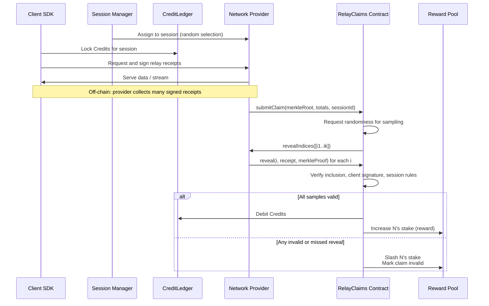
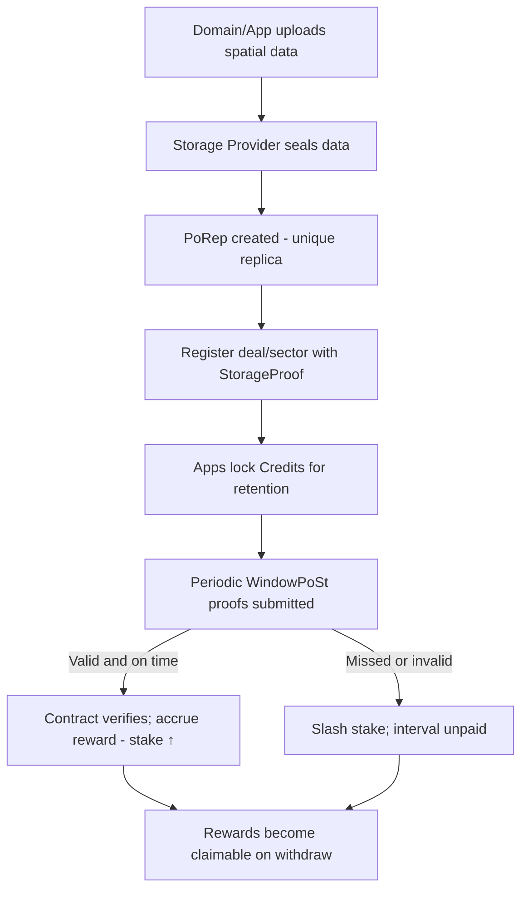
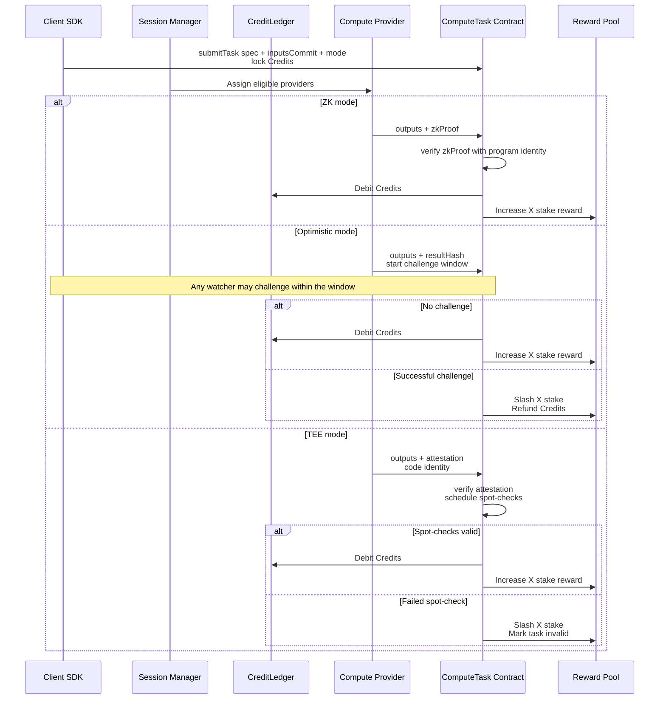

# Auki Network - Web3 Architecture Overview

> How to **decentralize** what we built

## Background

This document **proposes** an architecture to make the [current architecture](02-web2-architecture.md) verifiable
on-chain:

* Proof of Relay for Network Providers.
* Proof of Storage for Data/Storage Providers.
* Proof of Compute for Computing Providers.
* Account Abstraction (AA) for user accounts and gas (4337 Paymasters).

## Design goals

* **Verifiability** via cryptographic evidence: every paid action is backed by a proof and/or a challenge window.
* **Modularity**: Storage, Network, and Compute proofs are independent modules.
* **Abstracted web3 complexity**: users and developers interact via ERC‑4337 smart accounts, sponsored gas via Paymasters,
  and session keys.
* **Pragmatic decentralization**: use existing, battle‑tested solutions when possible.

## On‑chain components

| Contract                | Purpose                                                                                                                 |
| ----------------------- | ----------------------------------------------------------------------------------------------------------------------- |
| **AukiToken**           | ERC‑20 \$AUKI on Base                                                                                                   |
| **Burn & CreditLedger** | Burn \$AUKI to mint **non-transferable Credits** at a dollar peg recorded at burn time using oracle price feeds         |
| **4337 Paymaster**      | Lets users/apps spend Credits for gas. Paymaster settles gas in ETH while debiting Credits.                             |
| **DomainRegistry**      | ERC‑1155 Domains + metadata (spatial types, minimum providers, policies)                                                |
| **ProviderRegistry**    | Registers Providers (Network/Storage/Compute) per Domain. Manages dynamic stake and slashing. Emits eligibility events. |
| **RewardPool**          | Receives a share of every burn; increases provider stakes as rewards proportional to debited Credits                    |
| **Proof modules**       | (a) **RelayClaims** (b) **StorageProof** (c) **ComputeTask**                                                            |
| **SessionManager**      | Randomly selects Provider sets per epoch using VRF (or drand) for unbiased assignment and verification sampling         |

**Note:** All contracts **remain** upgradeable and configurable by Auki Labs (for MVP).

## Credits, burns, and gas

* **Burn \$AUKI → Credits.** The contract snapshots a USD rate via oracle price feeds at the burn tx, so **1 Credit ≈ \$1** at
  burn time. We store that rate and mint the corresponding Credits into the **non‑transferable CreditLedger**.
* **4337 Paymaster.** Apps can sponsor gas by authorizing the Paymaster to debit Credits from their CreditLedger (or a sponsor’s
  CreditLedger). Users sign **UserOperations**; the Paymaster pays ETH gas on Base, then debits Credits.

## Provider staking and dynamic incentives

Providers stake a fixed amount of \$AUKI per Domain. The stake then increases or decreases based on performance.

* each **valid** proof increments stake by **+r%** of the original stake.
* each **invalid/missing** proof slashes **–p%** of the original stake.
* acceptable failure ratio = **r / p**

Parameters can be tuned by Auki Labs. See more details in [business-logic.md#dynamic-staking](01-business-logic.md#dynamic-staking).

## Proofs

### 1) Proof of Relay (Network Providers)

**Goal**
Pay Network Providers (relay nodes) for real work without logging every packet on‑chain.

**Core idea**
Clients sign a small “receipt” for each served request. Providers batch these receipts, commit a **Merkle‑sum root** on‑chain (a compact commitment), and then reveal a few random samples (picked by on‑chain randomness). If revealed samples check out, the whole batch is considered valid and the Provider is rewarded. If not, they’re slashed.

**Notes**
We don’t post every relayed **request** on‑chain. We only post one root and check random samples. Cheating is statistically risky and gets slashed; honest work is rewarded. This design has been proven ([POKT Docs][1], [HOPR Docs][2]).
HOPR’s proof system **uses onion routing**, which is more complex. POKT‑style may be enough for relay nodes; HOPR patterns could be used in **p2p** scenarios.

#### Step by step

1. **Session assignment.** For each domain/epoch, the protocol selects eligible Network Providers using unbiased randomness.
2. **Client requests.** The client opens a session and **locks Credits**.
3. **Relay receipt collection.** For each served request/stream, the client signs a tiny “receipt” including session id, request hash, bytes served, and a client signature. The Provider stores these receipts (relay proofs).
4. **Publish batch claim on‑chain.** Periodically, the Provider builds a Merkle‑sum tree over the receipts (values include work/bytes) and submits a **Claim** with the tree root.
5. **Random sampling.** The contract requests randomness and derives **k** random indices into the batch. The Provider must reveal those leaves (receipt + Merkle proof).
6. **Verification.** The contract checks:

    * leaf inclusion in the committed root,
    * the client signature on the receipt,
    * session/assignment rules (within the session window and correct pairing).
7. **Settle.** If all samples pass → **debit Credits** from the client’s lock and **increase the Provider’s stake** (reward). If any fail or the Provider misses the reveal window → **slash** (penalty) and **invalidate** the claim.

High‑level flow (illustrative; details may vary):

---

### 2) Proof of Storage (Storage Providers)

**Goal**
Pay Storage Providers that store Domain data for an agreed retention period.

**Core idea**
A Storage Provider first proves they created a **unique sealed replica** of your data (**PoRep**). Then, on a schedule, they submit **WindowPoSt** proofs to show the data remains available over time. We verify those receipts/commitments on L2 and pay/slash stakes accordingly. (Battle‑tested in Filecoin.) ([Filecoin Docs][3])

#### Step by step

1. **Pin data.** A Domain owner or app pins spatial assets (maps, meshes, textures) to a Storage Provider (**Credits are locked** for retention).
2. **Onboarding proof (PoRep).** The Storage Provider seals the data into sectors and obtains a **Proof‑of‑Replication** (a cryptographic claim they store a unique copy). They register the deal/sector id with the **StorageProof** contract.
3. **Ongoing proofs (WindowPoSt).** The Provider periodically submits **WindowPoSt** proofs for the sectors that contain the Domain’s data, within deadline windows (each day is split into windows).
4. **Verification & settlement.** The contract checks the proof receipts against commitments. If a window is satisfied → **accrue reward** (increase stake). If a window is missed/invalid → **slash stake**.

---

### 3) Proof of Compute (Computing Providers)

Different tasks need different verification. We support **three modes** depending on the task:

* **ZK validity proofs** (best when feasible): Provider returns a **zero‑knowledge proof** that a program ran correctly on given inputs. Works for deterministic and circuit/zkVM‑friendly tasks. ([RISC Zero Docs][4])
* **Optimistic verification** (general‑purpose): Provider returns a result immediately; a **challenge window** allows disputes. If a challenger proves fraud via an **interactive verification game** (Truebit‑style), the provider is slashed and funds are refunded; if no challenge, pay. ([Truebit][5])
* **TEE attestation** (hardware‑based trust): Provider runs inside a **Trusted Execution Environment** and returns **remote attestation** proving code identity. The protocol may require **random spot‑checks**; failures are slashed. Useful for heavy or non‑deterministic GPU paths until ZK/optimistic becomes practical. (Intel SGX DCAP)

**Notes**

* ZK gives cryptographic proof when circuits/zkVMs are practical.
* Optimistic gives broad coverage with on‑chain game‑theoretic checks.
* TEE provides hardware attestation of code identity (not a cryptographic proof of computation correctness); we contain trust via spot‑checks and slashing.

#### Step by step

1. **Task post & lock.** Client posts a Task spec (program id, inputs commitment, output type, mode) and **locks Credits**.
2. **Assignment.** SessionManager picks eligible Compute Providers for the Domain (one‑time or for a time window).
3. **Execution & submission.** Provider executes and submits:

    * **ZK mode:** `(output, zkProof)` that verifies on‑chain against the program id (image hash). Pay instantly on success.
    * **Optimistic mode:** `(output, commitment)` starts a **challenge window**. If a challenger proves fraud via the verification game, **slash** the provider and **refund**; if no challenge, pay.
    * **TEE mode:** `(output, attestation)` is checked against allowed code identity; the protocol may require spot‑checks before/after payment.
4. **Settle.** On acceptance, **debit Credits** and **increase the Provider’s stake**. On failure/fraud, **slash**.

---

### Common mechanics across all proofs

* **Credits & gas UX.** Users interact via **ERC‑4337 smart accounts**. A **Paymaster** pays gas and then **debits Credits** after on‑chain success. This keeps UX “gasless.” ([AA Docs][6])
* **Randomness.** Selection and sampling use **Chainlink VRF** (on‑chain verifiable) or **drand** beacons.
* **Dynamic staking.** Every valid proof slightly **increases** the Provider’s stake (compounds performance); every invalid/missing proof **slashes** it. Providers withdraw accumulated rewards **when they withdraw stake**, per protocol rules.

### Key parameters (per Domain or network‑wide)

* **Relay:** batch interval, number of sampled leaves `k`, reveal deadline, per‑byte or per‑request pricing, slash ratio.
* **Storage:** minimum deal term, PoSt grace windows, missed‑window penalties, retrieval pricing.
* **Compute:** task type and allowed modes per task, challenge window (optimistic), zk verifier id(s), accepted TEE code hash(es), sampling rate for spot‑checks, reward weights.
* **Credits:** lock timeout, **refund rules on failed claims**, Paymaster policy (who sponsors gas).

## References

* **Relay proofs:** Pocket Network’s claim/reveal sampling over Merkle roots; overview of relay proofs. [1]
* **Randomness:** Chainlink VRF; drand.
* **Storage proofs:** Filecoin’s PoRep and WindowPoSt docs. [3]
* **Compute (ZK):** RISC Zero zkVM (on‑chain verifiable receipts). [4]
* **Compute (Optimistic):** Truebit docs and paper (interactive verification game). [5]
* **Compute (TEE):** Intel SGX DCAP attestation.
* **AA / Paymasters:** ERC‑4337 overview and Paymaster docs. [6]

[1]: https://docs.pokt.network/pokt-protocol/the-morse-protocol "The Morse Protocol | POKT DOCs"
[2]: https://docs.hoprnet.org/core/proof-of-relay "Proof of Relay"
[3]: https://docs.filecoin.io/basics/the-blockchain/proofs "Proofs"
[4]: https://dev.risczero.com/api/zkvm "zkVM Overview | RISC Zero Developer Docs"
[5]: https://docs.truebit.io/v1docs "Truebit on Ethereum v1: Overview"
[6]: https://docs.erc4337.io "AA Overview"
