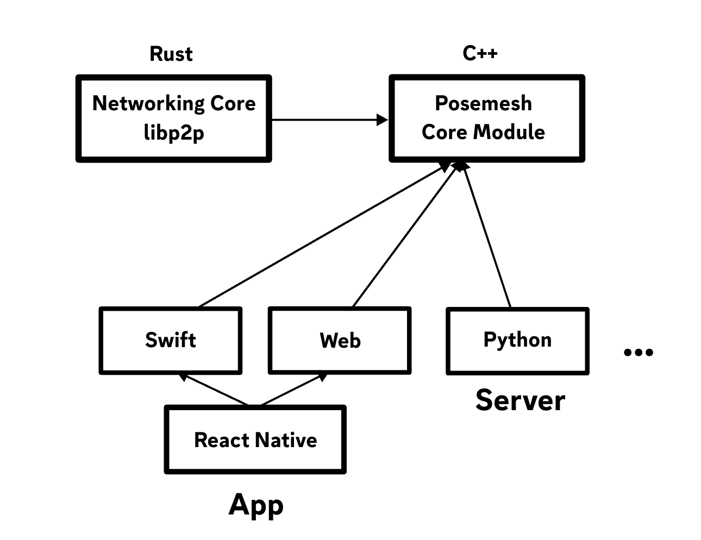

# Posemesh SDK

_A first subset of the Posemesh SDK code will be published here soon._

The Posemesh SDK is the successor of the [ConjureKit SDK](https://conjurekit.dev), rewritten and designed from the ground up to be **open-source, cross-platform and extensible**.

The purpose of the SDK is to allow a device to exchange spatial data and compute tasks with other devices, ultimately to communicate about a shared coordinate system.

Any application, device or server interacting with the posemesh will use the Posemesh SDK to communicate with other devices in a standardised way.

## SDK Architecture
For the posemesh to work on a wide range of devices and software stacks, cross-platform support is a big part of the architecture. The majority of code is written in C++ and then cross-compiled with bindings to other languages. The only exception is the core networking base code, which is written in Rust because the libp2p library for C++ doesn't support all required features yet.

This approach avoids code duplication and makes sure the SDK works the same regardless of platform or programming language.



### Modules

**Modules** are groups of related SDK functionality, similar to modules in the ConjureKit SDK.

- Posemesh module (”libposemesh”)
- Feature modules

The **Posemesh module** contains all the essential parts needed for interacting with the posemesh. This includes functionality for handling domains, authentication, reputation, tasks, registration and capabilities for all nodes and the peer-to-peer networking protocol used by nodes to communicate with each other.

Other **feature modules** enable different types of functionality, similar to how modules are used in the ConjureKit SDK already.

### Layers

**Layers** are for supporting multiple platforms.

Each module has a “**core layer**” and multiple “**platform layers**”. The purpose of this structure is to write as much logic as possible in one language, and then cross-compiling that into each platform. This makes it easier to maintain and develop the SDK, and also to add more platforms as needed in the future without re-implementing the entire SDK code.

All modules should as much as possible follow the same structure for multi-platform support. Consistency helps reusing tools and CI pipelines, and makes it easier to get familiar with all parts of the SDK. Certain parts of the SDK may be developed with a different language or less platform-independently, if the C++ approach doesn't fit.

### Networking

The Posemesh SDK uses a peer-to-peer networking protocol for nodes to communicate with
each other. This protocol is based on the [libp2p](https://libp2p.io) project, which is
a modular network stack for peer-to-peer applications. The Posemesh SDK uses a subset of
libp2p, and adds some custom functionality on top of it to make it work with the
posemesh.

The Rust implementation of libp2p is used since it is most maintained and up-to-date. However, since the majority of the Posemesh SDK is written in C++, the Rust code is not directly exposed to apps. Instead, it is wrapped in C++ to follow the same general approach to platform-specific bindings.

The features of libp2p that are used by the Posemesh SDK include:
* QUIC as a default transport protocol
* WebRTC as a default transport protocol for browsers
* WebSockets as a fallback transport protocol for browsers
* UPnP for enabling NAT traversal
* mDNS for local peer discovery
* UDP hole punching for NAT traversal when UPnP is not available or not working
* Circuit relay as a fallback when direct connections are not possible

Communications between nodes always use peer-to-peer connections when possible, but the
Posemesh SDK also supports using a relay server as a fallback when direct connections
are not possible. The relay server is only used as a last resort.

## How to build

### Prerequisites

* Rust - ([installation instructions](https://www.rust-lang.org/tools/install)) 
* Powershell - (`brew install powershell`)

### Step by step guide
1. Check out submodules:
```sh
git submodule update --init --recursive
```

2. Build base library (example debug build for ARM64 macOS, [details about building for different platforms & architectures here](https://github.com/aukilabs/posemesh/tree/main/core#building)):
```sh
./core/scripts/Build-Library.ps1 macOS ARM64 Debug base
```

3. Build OpenCV
```sh
./third-party/scripts/Build-OpenCV-Library.ps1 macOS ARM64 Debug
```

4. Build SDK library (example debug build for macOS, same supported platforms & architectures as the base library from step 2):
```sh
./sdk/scripts/Build-Library.ps1 macOS ARM64 Debug
```

5. Build output can be found int `./sdk/build-macOS-ARM64-Debug/` (the general case is `./sdk/build-[platform]-[architecture]-[Debug|Release]/`)

# Apple entitlements

To use the networking features on Apple platforms, it may be required to set both the `com.apple.security.network.client` and `com.apple.security.network.server` entitlements to `YES`.
